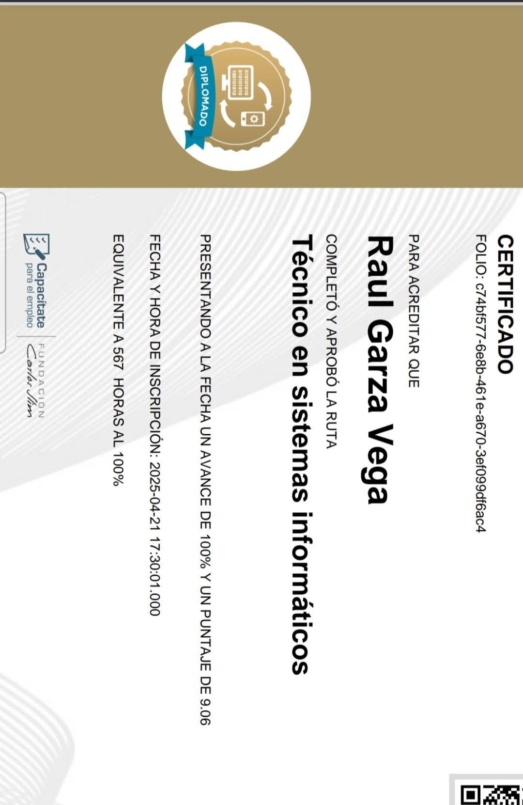





<meta name="viewport" content="width=device-width, initial-scale=1.0">
<link rel="stylesheet" href="assets/css/style.css">

<link href="https://cdn.jsdelivr.net/npm/bootstrap@5.3.2/dist/css/bootstrap.min.css" rel="stylesheet">

<nav class="navbar navbar-expand-lg navbar-dark bg-dark fixed-top">
  

    <!-- Logo o título -->
    <a class="navbar-brand" href="#">🛡️ Ciberseguridad</a>

    <!-- Botón hamburguesa en móvil -->
    <button class="navbar-toggler" type="button" data-bs-toggle="collapse" data-bs-target="#navbarNav"
      aria-controls="navbarNav" aria-expanded="false" aria-label="Toggle navigation">
      
    </button>

    <!-- Enlaces -->
    

      <ul class="navbar-nav ms-auto">
        <li class="nav-item">
          <a class="nav-link active" href="#">Inicio</a>
        </li>
        <li class="nav-item">
          <a class="nav-link" href="#sobre-mi">Sobre mí</a>
        </li>
        <li class="nav-item">
          <a class="nav-link" href="#portafolio">Portafolio</a>
        </li>
        <li class="nav-item">
          <a class="nav-link" href="#contacto">Contacto</a>
        </li>
      </ul>
    

  

</nav>

<video autoplay muted loop id="bg-video">
  <source src="assets/video/RAGV-fondo.mp4" type="video/mp4">
</video>

  <h1>🛡️ Bienvenido a mi página de ciberseguridad</h1>
  
Soy Raul Garza, apasionado de la ciberseguridad y en formación como Blue Team Specialist.  
En este sitio comparto mis aprendizajes, proyectos y experiencias en defensa de sistemas, análisis de vulnerabilidades y laboratorios prácticos.

## 👨‍💻 Sobre mí
- **Experiencia:** Configuración de entornos seguros, análisis de vulnerabilidades y prácticas en laboratorios de ciberseguridad.  
- **Educación:** En constante aprendizaje y formación en seguridad informática.  
- **Certificaciones en progreso:**  
  - Cisco CyberOps Associate  
  - Ethical Hacking  

<!-- Carrusel -->

  <h2 class="text-center text-success">🚀 Mis proyectos destacados</h2>
  
  

    <!-- Indicadores -->
    

      <button type="button" data-bs-target="#carouselCyber" data-bs-slide-to="0" class="active"></button>
      <button type="button" data-bs-target="#carouselCyber" data-bs-slide-to="1"></button>
      <button type="button" data-bs-target="#carouselCyber" data-bs-slide-to="2"></button>
    

    

      

        
        

          <h5>🔍 Proyecto 1</h5>
          
Análisis de vulnerabilidades con Nmap.

        

      

      

        
        

          <h5>🛡️ Proyecto 2</h5>
          
Defensa de sistemas en laboratorio.

        

      

      

        
        

          <h5>💻 Proyecto 3</h5>
          
Monitoreo de tráfico con Wireshark.

        

      

    

    <!-- Controles -->
    <button class="carousel-control-prev" type="button" data-bs-target="#carouselCyber" data-bs-slide="prev">
      
    </button>
    <button class="carousel-control-next" type="button" data-bs-target="#carouselCyber" data-bs-slide="next">
      
    </button>
  

## 📂 Portafolio

### 🔍 Proyecto 1: Análisis de vulnerabilidades en sistemas de prueba
- **Descripción:** Evaluación de seguridad en un entorno controlado para identificar riesgos potenciales.  
- **Tecnologías utilizadas:** Kali Linux, Nmap, Wireshark.  
- **Resultados:** Identificación de vulnerabilidades críticas y propuesta de mitigación.  
- 🔗
